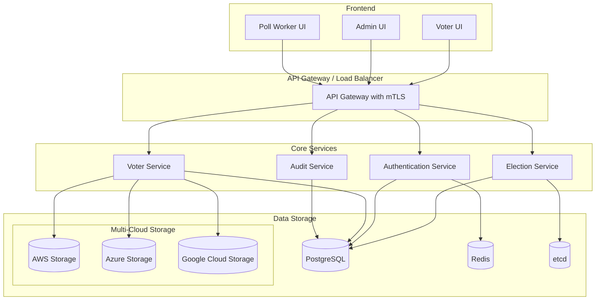
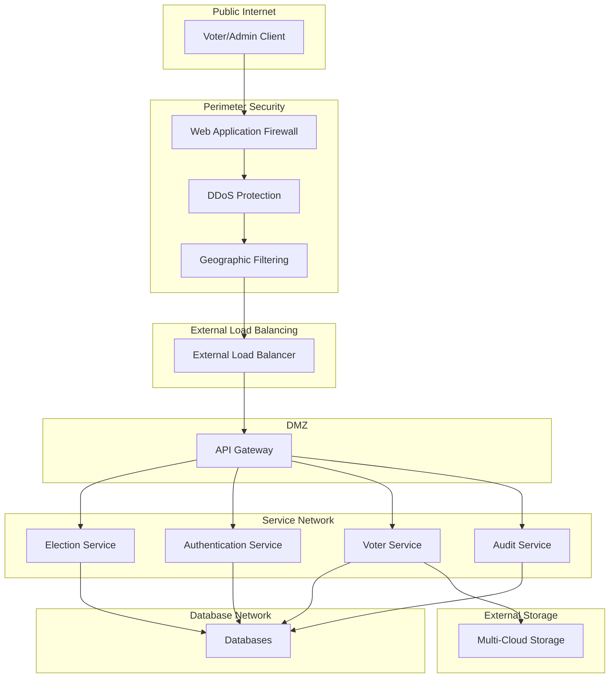

# System Architecture

The GoVote-IO system is built with a microservices architecture that prioritizes security, transparency, and reliability. This document provides a comprehensive overview of the system's major components, their interactions, and the underlying security model.

## High-Level Architecture Overview

GoVote-IO follows a microservices architecture with strict service boundaries and secure communication channels. The system is designed to be deployable across multiple environments while maintaining consistent security properties.

## Core Services

The system is composed of the following core services:

### 1. Election Service
- **Repository**: [govote_election_service](https://github.com/GoVote-IO/govote_election_service)
- **Purpose**: Provides CRUD operations for creating and managing elections
- **Features**:
  - Election creation and configuration
  - Candidate management
  - Ballot design
  - Results publication
- **Technical Details**:
  - Goa-based API design
  - Election-specific language interpreter
  - Geographic jurisdiction management
  - Results reporting engine

### 2. Authentication Service
- **Repository**: [govote_authentication_service](https://github.com/GoVote-IO/govote_authentication_service)
- **Purpose**: Handles authentication for voters, poll workers, and administrators
- **Features**:
  - Secure identity verification
  - Role-based access control
  - FIDO2/WebAuthn with hardware security keys for officials
  - Anonymous voting token generation
- **Technical Details**:
  - Federated authentication model per jurisdiction
  - No global user database to prevent single point of failure
  - Location-bound authentication for voting
  - JWT-based service-to-service communication

### 3. Voter Service
- **Repository**: [govote_voter_service](https://github.com/GoVote-IO/govote_voter_service)
- **Purpose**: Manages the voting process and records votes
- **Features**:
  - Ballot presentation
  - Vote recording
  - Receipt generation
  - Multi-cloud storage replication
- **Technical Details**:
  - Triplicate storage across AWS, Azure, and Google Cloud
  - Independent, queued transactions for each cloud destination
  - SHA-256 hash generation for each ballot
  - PDF format with embedded cryptographic signatures

### 4. Audit Service
- **Purpose**: Provides real-time verification of system integrity
- **Features**:
  - Cross-cloud ballot verification
  - Half-hourly comprehensive audit cycle during voting
  - Alert system for discrepancies
  - Transaction integrity verification
- **Technical Details**:
  - Cross-cloud hash verification via `audit sha` tool
  - Tiered alerting based on severity
  - Comprehensive audit logging

## Data Flow and Storage Mechanisms

The voting process follows this detailed flow:

1. **Election Setup**: 
   - Administrator creates an election through the Election Service
   - Configuration is stored in the PostgreSQL database
   - System configuration is maintained in etcd

2. **Voter Verification**:
   - Voter arrives at polling location and is verified by poll worker
   - Authentication Service verifies identity but does not link to voting session
   - Anonymous credential is issued for voting after in-person verification
   - Credentials are time-limited and location-bound

3. **Vote Casting**:
   - Voter receives a secure, anonymous token to access ballot
   - Voter Service presents appropriate ballot based on precinct
   - Vote is recorded with multiple integrity checks
   - System generates cryptographic receipt for voter verification

4. **Vote Storage**:
   - Votes are stored as PDF documents with embedded signatures
   - Each vote is stored redundantly across AWS, Azure, and Google Cloud
   - Independent, queued transactions ensure storage reliability
   - SHA-256 hash is generated for each ballot for verification
   - Each cloud provider maintains its own isolated storage system

5. **Continuous Auditing**:
   - Audit Service performs half-hourly verification during active elections
   - Cross-cloud hash verification ensures vote integrity
   - Any discrepancies trigger immediate alerts
   - All audit actions are logged securely

6. **Results Publication**:
   - Once the election is closed, results are tallied and published
   - Results are digitally signed to prevent tampering
   - Public verification tools allow independent validation

## Security Model Architecture

Security is built into every layer of the architecture:

### Authentication and Authorization
- **Multi-Factor Authentication**: Hardware security keys for officials
- **Zero-Trust Architecture**: Every service request is fully authenticated
- **Federated Authentication**: No central user database
- **Anonymous Voting**: Complete separation of identity from vote

### Communication Security
- **End-to-End Encryption**: All data in transit is encrypted using TLS 1.3
- **Mutual TLS**: Service-to-service communication requires mutual authentication
- **JWT-based Tokens**: Secure, short-lived authentication tokens
- **Network Policies**: Strict control over which services can communicate

### Data Protection
- **Multi-Cloud Redundancy**: Vote data is replicated across AWS, Azure, and Google Cloud
- **End-to-End Encryption**: All sensitive data is encrypted in transit and at rest
- **Key Rotation**: Regular cryptographic key rotation procedures
- **Immutable Storage**: Vote records are immutable once recorded

### Geographic Security
- **Geofencing**: Voting is restricted to authorized physical locations
- **IP Allowlisting**: by precinct for voting endpoints
- **US-Only Traffic**: Filtering to prevent international interference
- **Precinct Isolation**: Strong isolation between geographic jurisdictions

### Audit and Monitoring
- **Real-Time Auditing**: Continuous verification of system integrity
- **Comprehensive Logging**: Detailed audit trails for all operations
- **Alert System**: Immediate notification of potential issues
- **Cross-Cloud Verification**: Independent confirmation across providers

## Deployment Options

GoVote-IO supports multiple deployment models to meet the needs of different jurisdictions:

### Cloud-Based Deployment
- **Architecture**: Full Kubernetes-based deployment
- **Providers**: Support for AWS, Azure, and Google Cloud
- **Scalability**: Horizontal scaling for high-demand periods
- **Management**: Centralized management via Infrastructure as Code
- **Security**: Cloud-native security controls with enhanced protections

### On-Premises Deployment
- **Hardware Requirements**: Standard x86 servers with sufficient redundancy
- **Orchestration**: Lightweight Kubernetes (K3s) for resource efficiency
- **Network**: Secure internal network with controlled external access
- **Backup**: Local and offsite backup capabilities
- **Security**: Hardened configurations with physical security controls

### Hybrid Deployment
- **Architecture**: Core services on-premises with cloud backup
- **Data Flow**: Primary operations on local hardware, replication to cloud
- **Failover**: Automatic failover to cloud in case of local failure
- **Management**: Unified management plane for both environments
- **Security**: Consistent security controls across environments

### Air-Gapped Deployment
- **Architecture**: Completely isolated from public networks
- **Data Transfer**: Secure, verified data transfer procedures
- **Hardware**: Redundant local systems with multiple security layers
- **Operations**: Specialized procedures for offline operation
- **Security**: Physical and digital security measures for maximum protection

## Network Architecture

The network architecture is designed with multiple security layers:

### Network Security Features
- **Segregated Networks**: Strict separation between service types
- **Internal Firewalls**: Controls traffic between network segments
- **Zero-Trust Networking**: Every connection requires full authentication
- **Encrypted Backhaul**: Secure connections to cloud providers
- **Redundant Paths**: Multiple network routes for reliability
- **Local Resilience**: Poll locations maintain local functionality during network issues

## Future Architecture Enhancements

We have plans to extend the architecture with:

1. **Advanced Analytics**: Real-time election statistics and participation metrics
2. **Extended Voting Methods**: Support for ranked choice, proportional, and other voting systems
3. **Enhanced Accessibility**: Additional interface options for voters with disabilities
4. **Multi-Language Support**: Expansion beyond English and Spanish
5. **Blockchain Verification**: Optional blockchain-based verification layer
6. **Enhanced Mobile Support**: Improved interfaces for mobile devices at polling stations

For more detailed technical specifications, please refer to our [GitHub repositories](https://github.com/GoVote-IO).